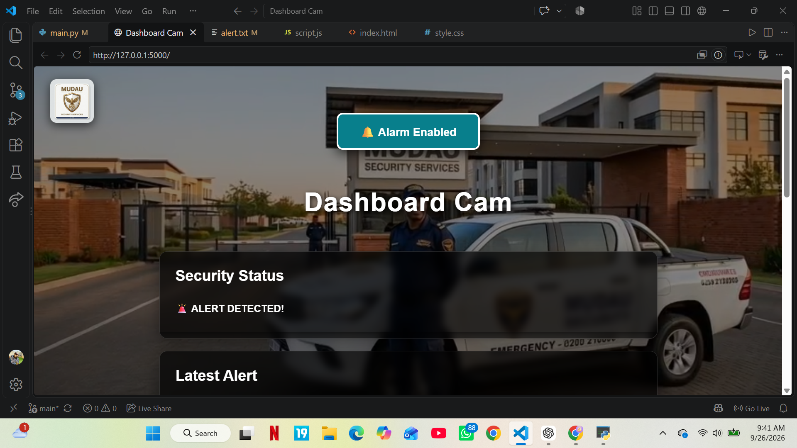
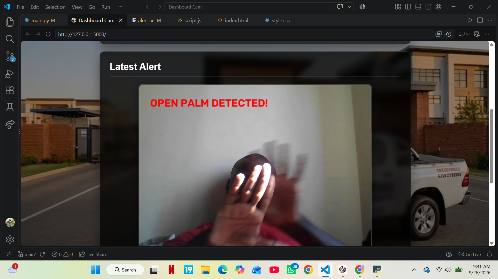
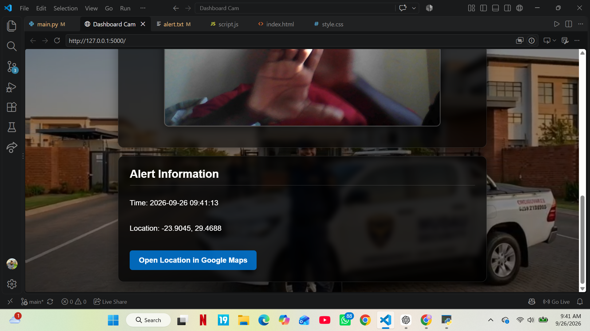

# Dashboard Cam

Dashboard Cam is a Python-based security camera system that uses computer vision to detect an open palm and create a security alert.

## Features

* Open-palm detection using MediaPipe
* Live camera monitoring using OpenCV
* Automatic alert detection
* Captures and saves an alert image
* Records the date and time of an alert
* Provides approximate location information
* Generates a Google Maps location link
* Web-based security dashboard
* Background video on the dashboard
* Alert image display
* Browser alarm notification
* Security status monitoring

## Technologies Used

* Python
* OpenCV
* MediaPipe
* Flask
* HTML
* CSS
* JavaScript
* Requests
* Google Maps

## Project Structure

```text
Dashboard-Cam/
│
├── main.py
├── alert.jpg
├── alert.txt
│
├── models/
│   └── hand_landmarker.task
│
└── Website_Security/
    ├── index.html
    ├── style.css
    ├── script.js
    ├── Home.mp4
    ├── logo.jpeg
    └── alarm.mp3
```

## How It Works

1. The Python program starts the computer camera.
2. MediaPipe analyzes the camera frames.
3. The system checks for an open palm.
4. When an open palm is detected, an alert is created.
5. The system saves a picture of the detection.
6. The alert time and approximate location are saved.
7. Flask provides the security dashboard.
8. The dashboard displays the latest alert information.
9. The browser alarm can notify the user when a new alert is detected.

## Screenshots

### Dashboard



### Open Palm Detection



### Security Alert




## Running the Project

Install the required Python packages:

```bash
pip install opencv-python mediapipe flask requests
```

Then run:

```bash
python main.py
```

Open the dashboard in your browser:

```text
http://127.0.0.1:5000
```

## Requirements

Before running the project, make sure you have:

* Python installed
* A working webcam
* Internet connection for approximate IP-based location
* The MediaPipe hand landmarker model
* The required Python packages installed

## Future Improvements

Possible future improvements include:

* Telegram notifications
* Live location tracking
* Improved alert management
* Multiple security cameras
* Alert history
* User authentication
* Improved hand detection accuracy
* Cloud-based monitoring

## Author

**Nduvho Mudau**

Diploma in Information Technology
Vaal University of Technology
